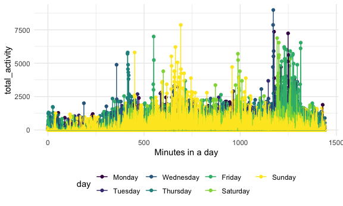
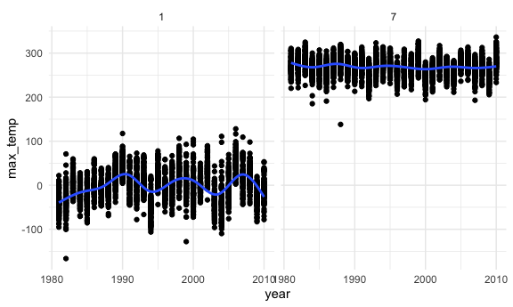
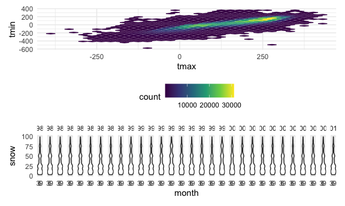

Homework 3
================

``` r
library(tidyverse)
```

    ## ── Attaching packages ──────────────────────────────────────────────────────────────────────────────────── tidyverse 1.3.0 ──

    ## ✓ ggplot2 3.3.2     ✓ purrr   0.3.4
    ## ✓ tibble  3.0.3     ✓ dplyr   1.0.0
    ## ✓ tidyr   1.1.0     ✓ stringr 1.4.0
    ## ✓ readr   1.3.1     ✓ forcats 0.5.0

    ## ── Conflicts ─────────────────────────────────────────────────────────────────────────────────────── tidyverse_conflicts() ──
    ## x dplyr::filter() masks stats::filter()
    ## x dplyr::lag()    masks stats::lag()

``` r
library(p8105.datasets)
library(patchwork)
library(plotly)
```

    ## 
    ## Attaching package: 'plotly'

    ## The following object is masked from 'package:ggplot2':
    ## 
    ##     last_plot

    ## The following object is masked from 'package:stats':
    ## 
    ##     filter

    ## The following object is masked from 'package:graphics':
    ## 
    ##     layout

``` r
knitr::opts_chunk$set(
  fig.width = 6,
  fig.asp = 0.6,
  out.width = "90%"
)

theme_set(theme_minimal() + theme(legend.position = "bottom"))

options(
  ggplot2.continuous.colour = "viridis",
  ggplot2.continuous.fill = "viridis"
)

scale_colour_discrete = scale_colour_viridis_d
scale_fill_discrete = scale_fill_viridis_d
```

## Problem 1

### Part 1

Load Instacart dataset.

``` r
data("instacart")
```

“The Instacart Online Grocery Shopping Dataset 2017” is an anonymized
dataset with 1384617 observations and 15 columns. The variable names are
order\_id, product\_id, add\_to\_cart\_order, reordered, user\_id,
eval\_set, order\_number, order\_dow, order\_hour\_of\_day,
days\_since\_prior\_order, product\_name, aisle\_id, department\_id,
aisle, department. These include names as character variables, and other
numeric variables. Key information of interest are products, aisles
(contains categorized products) and department (contains categorized
aisles).

### Part 2

How many aisles are there, and which aisles are the most items ordered
from?

``` r
q1_part2 = 
instacart %>% 
  count(aisle) %>% 
  arrange(desc(n)) # arranging in reverse order to know in which aisles are the most items ordered from. 
```

There are 134 aisles and fresh vegetables are the most ordered from.

### Part 3

Make a plot that shows the number of items ordered in each aisle,
limiting this to aisles with more than 10000 items ordered. Arrange
aisles sensibly, and organize your plot so others can read it.

``` r
instacart %>% 
  count(aisle) %>% 
  filter(n > 10000) %>% 
  mutate(
    aisle = factor(aisle),
    aisle = fct_reorder(aisle, n)
  ) %>% 
  ggplot(aes(x = aisle, y = n,)) +
  geom_point() +
  theme(axis.text.x = element_text(angle = 90, vjust = 0.5, hjust = 1))
```


### Part 4

Make a table showing the three most popular items in each of the aisles
“baking ingredients”, “dog food care”, and “packaged vegetables
fruits”. Include the number of times each item is ordered in your
table.

``` r
instacart %>% 
  filter(aisle %in% c("baking ingredients", "dog food care", "packaged vegetables fruits")) %>% 
   group_by(aisle) %>% 
  count(product_name) %>% 
  mutate(rank = min_rank(desc(n))) %>% 
  filter(rank <= 3) %>% 
  arrange(aisle, rank) %>% 
  relocate(rank, n) %>% 
  knitr::kable()
```

| rank |    n | aisle                      | product\_name                                 |
| ---: | ---: | :------------------------- | :-------------------------------------------- |
|    1 |  499 | baking ingredients         | Light Brown Sugar                             |
|    2 |  387 | baking ingredients         | Pure Baking Soda                              |
|    3 |  336 | baking ingredients         | Cane Sugar                                    |
|    1 |   30 | dog food care              | Snack Sticks Chicken & Rice Recipe Dog Treats |
|    2 |   28 | dog food care              | Organix Chicken & Brown Rice Recipe           |
|    3 |   26 | dog food care              | Small Dog Biscuits                            |
|    1 | 9784 | packaged vegetables fruits | Organic Baby Spinach                          |
|    2 | 5546 | packaged vegetables fruits | Organic Raspberries                           |
|    3 | 4966 | packaged vegetables fruits | Organic Blueberries                           |

### Part 5

Make a table showing the mean hour of the day at which Pink Lady Apples
and Coffee Ice Cream are ordered on each day of the week; format this
table for human readers (i.e. produce a 2 x 7 table).

``` r
instacart %>% 
  filter(product_name %in% c("Pink Lady Apples", "Coffee Ice Cream")) %>% 
  group_by(product_name, order_dow) %>% 
  summarize(mean_hour = mean(order_hour_of_day)) %>% 
  pivot_wider(
    names_from = order_dow,
    values_from = mean_hour
  ) %>% 
  knitr::kable()
```

    ## `summarise()` regrouping output by 'product_name' (override with `.groups` argument)

| product\_name    |        0 |        1 |        2 |        3 |        4 |        5 |        6 |
| :--------------- | -------: | -------: | -------: | -------: | -------: | -------: | -------: |
| Coffee Ice Cream | 13.77419 | 14.31579 | 15.38095 | 15.31818 | 15.21739 | 12.26316 | 13.83333 |
| Pink Lady Apples | 13.44118 | 11.36000 | 11.70213 | 14.25000 | 11.55172 | 12.78431 | 11.93750 |

## Problem 2

### Part 1

``` r
accel_df = (
  read_csv(file = "./data/accel_data.csv") %>% 
  janitor::clean_names() %>% 
    mutate(
      day = as.factor(day),
      day_id = case_when(
        day %in% c("Monday") ~ "1",
        day %in% c("Tuesday") ~ "2",
        day %in% c("Wednesday") ~ "3",
        day %in% c("Thursday") ~ "4",
        day %in% c("Friday") ~ "5",
        day %in% c("Saturday") ~ "6",
        day %in% c("Sunday") ~ "7"
      ),
      day_id = as.numeric(day_id)
      ) %>%
    pivot_longer(
      activity_1:activity_1440,
      names_to = "activity_min",
      values_to = "activity_count"
    ) %>% 
    separate(activity_min, into = c("activity", "activity_min"), sep = "_") %>% 
    select(-activity) %>% 
    mutate(activity_min = as.numeric(activity_min)) %>% 
    mutate(
    week_type = case_when(
      day %in% c("Monday", "Tuesday", "Wednesday", "Thursday", "Friday") ~ "Weekday",
      day %in% c("Saturday", "Sunday") ~ "Weekend",
      TRUE ~ ""
    ),
    day = forcats::fct_relevel(day, c("Monday", "Tuesday", "Wednesday","Thursday", "Friday","Saturday", "Sunday"))
  ))
```

    ## Parsed with column specification:
    ## cols(
    ##   .default = col_double(),
    ##   day = col_character()
    ## )

    ## See spec(...) for full column specifications.

This dataset contains details on accelerometer data recorded among 63
year old males admitted to the advanced cardiac care center at Columbia
University Medical Center and diagnosed with congestive heart failure.
This dataset contains 50400 observations and 6 variables. The variable
names are week, day\_id, day, activity\_min, activity\_count,
week\_type. The observations are recorded for five weeks and the weeks
are numbered from 1 to 5. The key variable of interest are
activity\_count and activity\_min that give us information on the
activity counts for each minute of a 24-hour day starting at midnight.

### Part 2

Traditional analyses of accelerometer data focus on the total activity
over the day. Using your tidied dataset, aggregate across minutes to
create a total activity variable for each day, and create a table
showing these totals. Are any trends apparent?

``` r
accel_df %>% 
  group_by(week, day) %>% 
  summarize(mean_activity = mean(activity_count)) %>% 
  pivot_wider(
    names_from = day,
    values_from = mean_activity
  ) %>% 
  knitr::kable()
```

    ## `summarise()` regrouping output by 'week' (override with `.groups` argument)

| week |    Monday |  Tuesday | Wednesday | Thursday |   Friday | Saturday |    Sunday |
| ---: | --------: | -------: | --------: | -------: | -------: | -------: | --------: |
|    1 |  54.74171 | 213.2599 |  236.1910 | 247.1692 | 333.7102 | 261.2875 | 438.26736 |
|    2 | 205.16042 | 293.9201 |  306.2236 | 329.2000 | 395.0271 | 421.6493 | 293.06806 |
|    3 | 476.32639 | 264.9354 |  325.6035 | 257.7986 | 324.5972 | 265.9222 | 324.34167 |
|    4 | 284.34028 | 221.9222 |  301.7083 | 236.3132 | 106.9785 |   1.0000 | 180.98403 |
|    5 | 270.19444 | 255.4333 |  309.2819 | 381.7069 | 431.1528 |   1.0000 |  96.12569 |

On average it seems like the mean minutes is higher on Fridays. Saturday
and Sunday in week 4 and 5 are relatively lower than the other 3 weeks.

### Part 3

``` r
accel_df %>%
  group_by(day_id) %>% 
  ggplot(aes(x = activity_min, y = activity_count, group = day_id, color = day)) +
  scale_x_continuous(name = "Minutes in a day", limits = c(0, 1440)) +
  geom_point() +
  geom_line()
```



## Problem 3

### Part 1

``` r
data("ny_noaa")
summary(ny_noaa)
```

    ##       id                 date                 prcp               snow       
    ##  Length:2595176     Min.   :1981-01-01   Min.   :    0.00   Min.   :  -13   
    ##  Class :character   1st Qu.:1988-11-29   1st Qu.:    0.00   1st Qu.:    0   
    ##  Mode  :character   Median :1997-01-21   Median :    0.00   Median :    0   
    ##                     Mean   :1997-01-01   Mean   :   29.82   Mean   :    5   
    ##                     3rd Qu.:2005-09-01   3rd Qu.:   23.00   3rd Qu.:    0   
    ##                     Max.   :2010-12-31   Max.   :22860.00   Max.   :10160   
    ##                                          NA's   :145838     NA's   :381221  
    ##       snwd            tmax               tmin          
    ##  Min.   :   0.0   Length:2595176     Length:2595176    
    ##  1st Qu.:   0.0   Class :character   Class :character  
    ##  Median :   0.0   Mode  :character   Mode  :character  
    ##  Mean   :  37.3                                        
    ##  3rd Qu.:   0.0                                        
    ##  Max.   :9195.0                                        
    ##  NA's   :591786

The NOAA dataset contains 2595176 observations and 7 variables. The
names of the variables are id, date, prcp, snow, snwd, tmax, tmin. The
key variables of interest are prcp, snow, tmax and tmin. There are
145838 missing data in the prcp column, 381221 missing data in the snow
coloumn and 591786 missing data in the snwd column. The high number of
missing variables needs to be taken into account when we go ahead with
data wrangling.

### Part 2

``` r
ny_noaa_df = (
  ny_noaa %>% 
  janitor::clean_names() %>% 
  separate(date, into = c("year", "month", "day"), sep = "-") %>% 
  mutate(
    year = as.numeric(year),
    month = as.numeric(month),
    day = as.numeric(day),
    tmax = as.numeric(tmax),
    tmin = as.numeric(tmin)
  ))
  # keep all the missing variables for now. 
```

Each observation for temperature, precipitation and snowfall are given
reasonable units. ( I decided not to change anything).

``` r
ny_noaa_df %>% 
  count(snow) %>% 
  arrange(desc(n))
```

    ## # A tibble: 282 x 2
    ##     snow       n
    ##    <int>   <int>
    ##  1     0 2008508
    ##  2    NA  381221
    ##  3    25   31022
    ##  4    13   23095
    ##  5    51   18274
    ##  6    76   10173
    ##  7     8    9962
    ##  8     5    9748
    ##  9    38    9197
    ## 10     3    8790
    ## # … with 272 more rows

Fo snowfall the three most commonly observed values are 25 (31022
values), 13(23095 values) and 51(18274 values). (Exclusing the times
there were no snowfall and the missing values)

### Part 3

Make a two-panel plot showing the average max temperature in January and
in July in each station across years. Is there any observable /
interpretable structure? Any outliers?

``` r
ny_noaa_df %>% 
  filter(month == c(1, 7)) %>%
  group_by(year, id, month) %>% 
  drop_na() %>%
  summarize(max_temp = mean(tmax)) %>% 
  ggplot(aes(x = year, y = max_temp)) + 
  geom_point() + 
  geom_smooth(se = FALSE) +
  facet_grid(. ~ month)
```

    ## `summarise()` regrouping output by 'year', 'id' (override with `.groups` argument)

    ## `geom_smooth()` using method = 'gam' and formula 'y ~ s(x, bs = "cs")'



From the graph we can see that the average maximum temperature is higher
in July than in January. The lowest average maximum temperature in July
is higher than the highest average maximum temperature in January. There
are a few outliers but not enough to skewer the general interpretation
of the graph.

### Part 4

Make a two-panel plot showing (i) tmax vs tmin for the full dataset
(note that a scatterplot may not be the best option); and (ii) make a
plot showing the distribution of snowfall values greater than 0 and less
than 100 separately by year.

``` r
plot1 = (
  ny_noaa_df %>%
    drop_na() %>% 
    ggplot(aes(x = tmax, y = tmin)) +
    geom_hex()
    )

plot2 = (
    ny_noaa_df %>% 
    filter(snow < 100) %>% 
      filter(snow > 0) %>% 
      group_by(year) %>% 
      drop_na() %>% 
      ggplot(aes( x = month, y = snow)) +
      geom_violin() +
      facet_grid(. ~ year)
        )
plot1 / plot2
```



Description - plot2 - It seems like there was more snowfalls in the
years 1999 and 1994 compared to others but mostly the snowfall is pretty
consistent.
